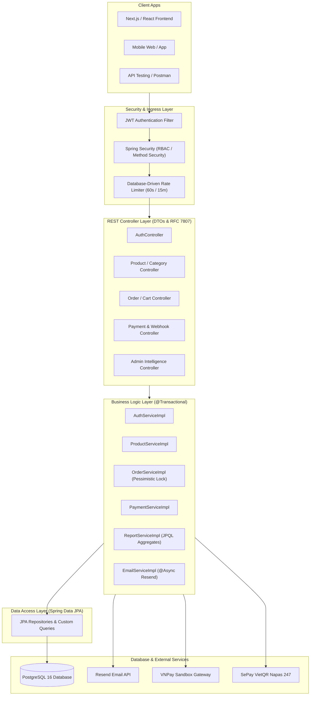

# 🛒 EcoMart Backend RESTful API

<div align="center">


-brightgreen?style=for-the-badge&logo=junit5&logoColor=white)


<p align="center">
  <b>Nền tảng Backend RESTful API Monolith cho Sàn Thương mại Điện tử B2C EcoMart — Chuyên kinh doanh sản phẩm tiêu dùng xanh và phát triển bền vững.</b>
</p>

[Tài liệu API Swagger](#-tài-liệu-api--swagger-ui) • [Cài đặt & Khởi động](#-cài-đặt--khởi-động-nhanh) • [Cấu hình Môi trường](#️-cấu-hình-biến-môi-trường-env) • [Kiểm thử Tự động](#-kiểm-thử-tự-động--chất-lượng-mã-nguồn)

</div>

---

## 📑 Mục lục
- [✨ Tính năng & Phân hệ Nghiệp vụ](#-tính-năng--phân-hệ-nghiệp-vụ)
- [🏛️ Kiến trúc Hệ thống](#️-kiến-trúc-hệ-thống)
- [🧰 Tech Stack](#-tech-stack)
- [📋 Yêu cầu Hệ thống](#-yêu-cầu-hệ-thống)
- [🚀 Cài đặt & Khởi động Nhanh](#-cài-đặt--khởi-động-nhanh)
- [⚙️ Cấu hình Biến Môi trường (.env)](#️-cấu-hình-biến-môi-trường-env)
- [📚 Tài liệu API & Swagger UI](#-tài-liệu-api--swagger-ui)
- [🧪 Kiểm thử Tự động & Chất lượng](#-kiểm-thử-tự-động--chất-lượng-mã-nguồn)
- [📂 Cấu trúc Dự án](#-cấu-trúc-dự-án)
- [📄 Giấy phép](#-giấy-phép)

---

## ✨ Tính năng & Phân hệ Nghiệp vụ

Dự án được phân tích và xây dựng hoàn chỉnh theo chuẩn **12 Phân hệ Nghiệp vụ (Modules)**:

| Module | Tên Phân Hệ | Chức Năng Chính |
|:---|:---|:---|
| **Module 1** | **Auth & Security Core** | Xác thực Stateless JWT (Access 24h, Refresh 7d), RBAC (`ADMIN`, `CUSTOMER`), RFC 7807 Error Handler. |
| **Module 1+** | **Email OTP & Anti-Spam** | Gửi OTP qua **Resend SDK**, Cooldown 60s, Rate Limit 5/15p (HTTP 429), Anti-Brute-Force (khóa sau 5 lần sai). |
| **Module 2** | **User Profile** | Xem profile, cập nhật thông tin cá nhân, đổi mật khẩu bảo mật (BCrypt). |
| **Module 3** | **Address Book** | Sổ địa chỉ giao hàng, đặt địa chỉ mặc định, xác thực chống IDOR (chỉ sửa địa chỉ của chính mình). |
| **Module 4** | **Category Management** | Quản lý danh mục phân cấp đa tầng (Hierarchical Categories), tự động tạo Slug SEO, ẩn/hiện danh mục. |
| **Module 5** | **Brand Management** | Quản lý thương hiệu đối tác, lọc thương hiệu khả dụng, kiểm tra ràng buộc trước khi xóa. |
| **Module 6** | **Product & Eco-Cert** | Đăng bán sản phẩm tiêu dùng xanh, chấm điểm **Eco-Score (1-5★)**, gắn nhãn chứng nhận sinh thái (FSC, Nhãn Xanh VN...). |
| **Module 7** | **Shopping Cart** | Giỏ hàng realtime, đồng bộ tồn kho khả dụng, tính toán tổng tiền tự động. |
| **Module 8** | **Order & Checkout** | Đặt hàng với **Pessimistic Lock** chống Oversell, Snapshot giá bán, Máy trạng thái đơn hàng và tự động hoàn kho khi hủy đơn. |
| **Module 9** | **Payment Gateways** | Tích hợp **VNPay Sandbox** (HMAC-SHA512 checksum) và **SePay VietQR 247** động, xác thực Webhook/IPN Server-to-Server. |
| **Module 10** | **Product Reviews** | Đánh giá 1-5★ chỉ dành cho đơn `COMPLETED`, kiểm duyệt ẩn/hiện đánh giá vi phạm. |
| **Module 11** | **Content & Settings** | Quản lý tin nhắn liên hệ khách hàng, nội dung chính sách tĩnh theo whitelist slug, cấu hình thông tin cửa hàng & Google Maps. |
| **Module 12** | **Admin Intelligence** | 12 APIs phân tích chuyên sâu: Doanh thu chu kỳ, Top bán chạy, Tỷ trọng danh mục/hãng, Tăng trưởng khách, VIPs, Cảnh báo tồn kho & CSAT. |

---

## 🏛️ Kiến trúc Hệ thống

Hệ thống tuân thủ mô hình **Layered Architecture** và nguyên tắc **12-Factor App**:



---

## 🧰 Tech Stack

| Danh mục | Công nghệ sử dụng |
|:---|:---|
| **Core Platform** | Java 17 / Java 21, Spring Boot 3.3.5 |
| **Security & Auth** | Spring Security 6, JJWT 0.12.6, BCrypt Password Encoder |
| **Data & ORM** | Spring Data JPA, Hibernate 6, PostgreSQL 16 (H2 cho Unit Testing) |
| **Email Gateway** | Resend Java SDK 3.1.0 (Async HTML Template) |
| **Payment Integrations** | VNPay Sandbox API (v2.1.0), SePay VietQR Napas 247 |
| **API Documentation** | Springdoc OpenAPI 2.6.0, Swagger UI 3.0 |
| **Utilities** | Lombok, Jackson (JSON), Dotenv (springboot3-dotenv) |
| **Build & Tooling** | Apache Maven, Maven Wrapper (`./mvnw`) |

---

## 📋 Yêu cầu Hệ thống

- **Java Development Kit (JDK)**: Phiên bản 17 hoặc 21 (`java -version`).
- **Maven**: 3.9+ *(hoặc sử dụng wrapper `./mvnw` có sẵn trong repo)*.
- **Database**: PostgreSQL 14+ *(hoặc Docker Desktop nếu chạy qua Compose)*.

---

## 🚀 Cài đặt & Khởi động Nhanh

### 1. Clone Source Code
```bash
git clone https://github.com/dinhtuandev/ecomart-backend.git
cd ecomart-backend
```

### 2. Thiết lập Biến Môi trường (.env)
Sao chép file mẫu `.env.example` thành `.env`:
```bash
cp .env.example .env
```
*(Điền mật khẩu Database và API Key nếu có).*

### 3. Biên dịch & Chạy Ứng dụng
```bash
# Sử dụng Maven Wrapper
./mvnw clean spring-boot:run

# Hoặc trên Windows PowerShell
.\mvnw.cmd clean spring-boot:run
```

Ứng dụng sẽ khởi động thành công tại: **`http://localhost:8081`**.

---

## ⚙️ Cấu hình Biến Môi trường (.env)

| Tên Biến Môi Trường | Kiểu | Mô Tả | Mẫu Giá Trị |
|:---|:---|:---|:---|
| `SERVER_PORT` | Integer | Cổng mạng của Backend API | `8081` |
| `SPRING_DATASOURCE_URL` | String | JDBC URL kết nối PostgreSQL | `jdbc:postgresql://localhost:5432/ecomart_db` |
| `SPRING_DATASOURCE_USERNAME`| String | Tên đăng nhập DB | `postgres` |
| `SPRING_DATASOURCE_PASSWORD`| String | Mật khẩu DB | `postgrespassword` |
| `APP_JWT_SECRET` | String | Khóa bí mật ký JWT ($\ge 256$ bits) | *(Chuỗi Hex 64 ký tự)* |
| `APP_JWT_EXPIRATION_MS` | Long | Thời gian sống của Access Token | `86400000` (24 giờ) |
| `APP_JWT_REFRESH_EXPIRATION_MS`| Long | Thời gian sống của Refresh Token | `604800000` (7 ngày) |
| `RESEND_API_KEY` | String | API Key của dịch vụ Resend Email | `re_xxxxxxxxxxxxxxxxx` |
| `RESEND_FROM_EMAIL` | String | Email người gửi | `EcoMart <onboarding@resend.dev>` |
| `VNPAY_TMN_CODE` | String | Mã Terminal của VNPay Sandbox | `DEMOVNPAY` |
| `VNPAY_HASH_SECRET` | String | Khóa Secret kiểm tra chữ ký VNPay | *(32 ký tự bí mật)* |
| `VNPAY_PAY_URL` | String | Cổng URL thanh toán VNPay | `https://sandbox.vnpayment.vn/paymentv2/vpcpay.html` |
| `VNPAY_RETURN_URL` | String | URL redirect khách hàng sau khi trả tiền | `http://localhost:3000/checkout/payment-return` |
| `SEPAY_API_KEY` | String | API Key xác thực SePay Webhook | `DEMO_SEPAY_API_KEY` |
| `SEPAY_ACCOUNT_NUMBER` | String | Số tài khoản ngân hàng nhận tiền | `0123456789` |
| `SEPAY_BANK` | String | Tên ngân hàng nhận VietQR | `MBBank` |

---

## 📚 Tài liệu API & Swagger UI

- 🟢 **Swagger UI (Giao diện tương tác & Test trực tiếp)**:  
  👉 **`http://localhost:8081/swagger-ui.html`**
- 📄 **OpenAPI Specification (JSON Format)**:  
  👉 **`http://localhost:8081/v3/api-docs`**

### 🔑 Tài khoản Quản trị Mặc định (Seed Data)
| Tài khoản | Mật khẩu | Quyền hạn (Role) |
|:---|:---|:---|
| `admin@ecomart.com` | `Admin123!` | `ADMIN` (Toàn quyền hệ thống) |

---

## 🧪 Kiểm thử Tự động & Chất lượng Mã nguồn

Dự án đạt tỷ lệ bao phủ kiểm thử cao, kiểm tra đầy đủ các kịch bản Success, Validation, Business Exception, Concurrency và Rate Limiting:

```bash
# Chạy toàn bộ 220 Unit & Integration Tests
./mvnw clean test
```

### Kết quả Kiểm thử:
```
[INFO] Results:
[INFO] Tests run: 220, Failures: 0, Errors: 0, Skipped: 1
[INFO] ------------------------------------------------------------------------
[INFO] BUILD SUCCESS
[INFO] ------------------------------------------------------------------------
```

---

## 📂 Cấu trúc Dự án

```text
ecomart-backend/
├── src/
│   ├── main/
│   │   ├── java/com/ecomart/
│   │   │   ├── config/          # Cấu hình Security, CORS, OpenAPI, Payment, Async
│   │   │   ├── controller/      # REST API Controllers (V1)
│   │   │   ├── dto/             # Request & Response Data Transfer Objects
│   │   │   ├── entity/          # JPA Entities & Enums
│   │   │   ├── exception/       # Custom Exceptions & Global Exception Handler (429, 409, 404...)
│   │   │   ├── repository/      # Spring Data JPA Repositories & JPQL Analytics Queries
│   │   │   ├── security/        # JWT Token Provider, Auth Filter & UserPrincipal
│   │   │   ├── service/         # Service Interfaces & Implementations (@Transactional)
│   │   │   └── util/            # VNPay Hashing, Slug Generator & Helpers
│   │   └── resources/
│   │       ├── application.yml  # File cấu hình trung tâm (Mapping 100% từ .env)
│   │       └── data.sql         # Seed data mẫu ban đầu (Roles, Admin, Categories...)
│   └── test/                    # 220 Unit Tests & Integration Tests (MockMvc, Mockito, H2)
├── .env.example                 # Template cấu hình mẫu chuẩn
├── compose.yaml                 # Docker Compose (PostgreSQL cho production)
├── pom.xml                      # Quản lý thư viện Maven
└── README.md                    # Tài liệu hướng dẫn dự án
```

---

## 📄 Giấy phép

Dự án được phát hành theo giấy phép **[MIT License](LICENSE)**.
